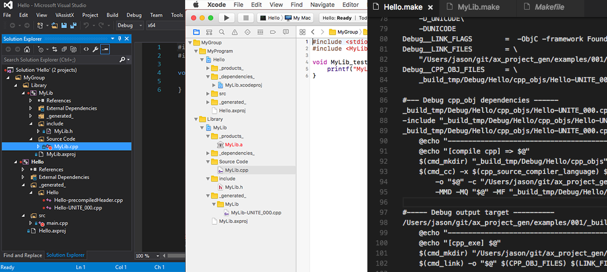

# ax_project_gen
C++ Project Generator

### Feature Highlights:
* Lightweight - only C++11 is required ! *( No lua, python, java or any packages dependencies )*<br>

* Run on multiple platforms *( Windows / MacOSX / Linux / FreeBSD )*

* Auto inherit configuration from depended projects, for instance executable project depends on library<br>
will inherit all settings by default *( e.g. include_dir, cpp_defines, output_library ...etc )*

* Add source file by wildcard, glob with sub-directories *( example: ```src/**/*.cpp```,
means all c++ files within `src` folder including all sub-directories recursively)*

* Using relative path in generated projects, therefore project can be move between folders or share for other users

* Support file path with space and Unicode

* Support Project Group, Virtual Folder in Visual Studio solution or Xcode workspace

* Precompiled header - and auto force-include to all c++ files<br>
`(*In vs2015 precompiledHeader.cpp will be auto generated)`

* Unite Build - build multiple small C/C++ file at once to improve the compile time

* Generate proejct / makefile with multi-thread settings

* Support CUDA Visual Studio project


**Command Line:**
```
ax_gen.exe ws=<Workspace File> [gen=<Geneartor>] [os=<target OS>] [cpu=<target CPU>] [config=<Name>] [-gen] [-build] [-ide] [-run] [-verbose] 
```
- `arguments can be in random order`

**Example:**
```
ax_gen.exe ws=examples/001/Hello.axworkspace -gen
```

|**Actions:**||
|-----------|------------------------------|
| -gen	    | generate target projects     |
| -build    | build projects               |
| -ide	    | open IDE                     |
| -run	    | run startup project          |
| -verbose  | more detail in console / log |

|**OS options:**||
|------------|------------|
| os=windows | Windows    |
| os=macosx  | MacOSX     |
| os=ios     | iOS Device |
| os=linux   | Linux      |
| os=freebsd | FreeBSD    |

|**CPU Options:**||
|------------|------------|
| cpu=x86    | Intel / AMD 32-bit CPU  |
| cpu=x86_64 | Intel / AMD 64-bit CPU  |

|**Generators:**|||
|------------------|-----------------------------------------|---|
| gen=vs2015       | Visual Studio 2015<br>*(default on Windows)*  ||
| gen=vs2017       | Visual Studio 2017<br>*(default on Windows)*  ||
| gen=vs2017_linux | `(experimental!)` Visual Studio 2017 Linux Remote Compile ||
| gen=xcode        | Xcode<br>*(default on MacOSX)* ||
| gen=makefile     | GNU makefile format<br> | `*support file path with space` <br>`(Which handwritten Makefile might have problem`<br>`during 2nd degree variable evaluation)` |

|**Compiler options:**||
|----------------|-----------------|
| compiler=vc    | MS Visual C++<br>*(default in gen=vs2015)*  |
| compiler=gcc   | GNU C/C++<br>*(default in gen=makefile)*    |
| compiler=clang | clang from LLVM<br>*(default in gen=xcode)* |

|**Config options:**||
|---|---|
| config=&lt;Name&gt; | configuration for action [-build] or [-run] |

<br>
<br>

--------

### Example output: ( *Visual Studio / Xcode / Makefile* )


### Example Input: *Hello.axproj*:
```javascript
{
	"group": "MyGroup/MyProgram",
	"type": "cpp_exe",
	"dependencies": ["MyLib"],
	"pch_header": "src/precompiledHeader.h",

	//"unite_build": true,
	//"unite_filesize": 1,
	"files" : [
		"src/*.cpp",
		"*.axproj"
	],
	"exclude_files": [
	],		

	"config": {
		"cpp_defines": [],
		"cpp_flags": [],
		"include_dirs": ["src"],
		"include_dirs.local": ["header_only_for_this_but_not_inherit_projects"],
		"link_dirs": [],
		"link_files": [],
		"link_flags": [],
		"compiler==gcc": {
			"link_flags":["-lm"]			
		},
		"compiler==clang": {
			"link_flags":["-lm"]			
		}
	}
}

```
# How to build
#### Windows
vs2015 solution in ```./projects/vs015/ax_gen.sln to build```
#### Mac
Xcode project in ```./project/xcode/ax_gen.xcodeproj```
#### FreeBSD / Linux
run `make` under ./project/makefile folder
#### In case don't have 'Make' but gcc / clang only
```g++ -std=c++11 src/_single_file_build_.cpp -o ax_gen```

# TODO
* Android project support
* Cross-compile
* Pre / Post build step for VS, Xcode, Makefile

# If you're interested to
* [Another generator again ? Why Not XYZ ... please click here](doc/Why_Not_XYZ.md)
